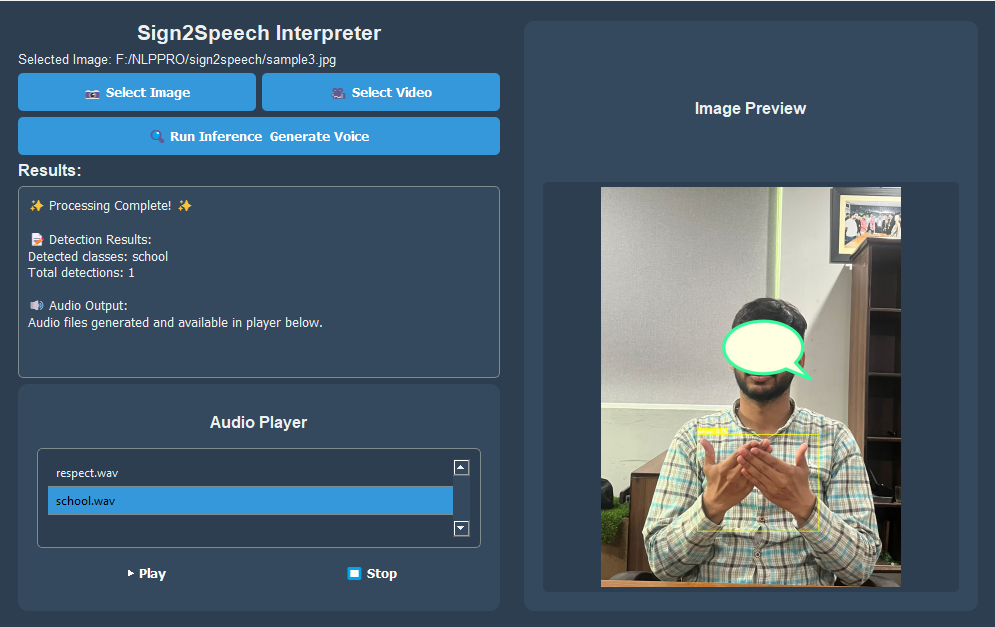

# Sign2Speech - Professional Sign Language Interpreter



A real-time sign language interpretation system that converts sign language gestures into natural speech using computer vision, deep learning, and natural language processing.

## 🚀 Features

- **Real-time Sign Language Detection**: Custom YOLO12 model trained for 22 sign language gestures
- **Multi-gesture Tracking**: DeepSORT algorithm for consistent gesture identification
- **Natural Language Processing**: Converts gesture sequences into grammatically correct sentences
- **Voice Synthesis**: Text-to-speech conversion with audio file generation
- **Professional GUI**: Modern PyQt5 interface with dark theme
- **Image & Video Support**: Process both static images and video files
- **Audio Playback**: Integrated audio player for generated speech

## 📋 Supported Sign Language Gestures

The system recognizes 22 different sign language gestures:
- **Basic**: school, sorry, help, easy, work, age, effort, respect
- **Location**: near, home, village, washroom
- **Social**: friend, teacher, message, good
- **Actions**: eating, drinking, pass, fail
- **Settings**: preset, dress

## 🏗️ System Architecture

### Core Components

1. **YOLO12Detector** (`components/yolo_inference.py`)
   - Custom-trained YOLO model for sign language detection
   - Confidence-based filtering
   - Bounding box generation

2. **DeepSORTTracker** (`components/deep_sort_tracker.py`)
   - Object tracking for temporal consistency
   - Multi-object tracking capabilities
   - Track ID management

3. **SentenceBuilder** (`components/sentence_builder.py`)
   - Grammar templates and phrase patterns
   - Context-aware sentence construction
   - NLTK integration for advanced NLP

4. **TTSEngine** (`components/tts_engine.py`)
   - Text-to-speech conversion
   - Audio file generation and management

5. **Voice Pipeline** (`components/yolo2voice_pipeline.py`)
   - Ollama LLM integration for natural sentence generation
   - Context-aware prompts for different gesture types

### Supporting Utilities

- **DrawingUtils** (`utils/draw.py`): Visualization and annotation tools
- **SystemLogger** (`utils/system_logger.py`): Logging and monitoring
- **VideoProcessor** (`utils/video_utils.py`): Video frame handling

## 🔄 Workflow Pipeline

```
Input (Image/Video) → YOLO Detection → DeepSORT Tracking → 
Sentence Building → Ollama LLM → Text-to-Speech → Audio Output
```

### Detailed Process:

1. **Input Processing**: Accept image or video input through GUI
2. **Gesture Detection**: YOLO12 model detects sign language gestures
3. **Object Tracking**: DeepSORT maintains consistent gesture tracking
4. **Sequence Analysis**: Build gesture sequences from tracked objects
5. **Language Generation**: Convert sequences to natural language using Ollama
6. **Speech Synthesis**: Generate audio output using TTS engine
7. **User Interface**: Display results with visual annotations and audio playback

## 🛠️ Installation

### Prerequisites

- Python 3.8+
- CUDA-compatible GPU (recommended)
- Ollama server with llama3 model

### Dependencies

```bash
pip install -r requirements.txt
```

Key dependencies:
- `ultralytics` - YOLO implementation
- `PyQt5` - GUI framework
- `opencv-python` - Computer vision
- `numpy` - Numerical computing
- `pyttsx3` - Text-to-speech
- `requests` - HTTP client for Ollama
- `nltk` - Natural language processing (optional)

### Ollama Setup

1. Install Ollama: [https://ollama.ai](https://ollama.ai)
2. Pull the llama3 model:
   ```bash
   ollama pull llama3
   ```
3. Start Ollama server:
   ```bash
   ollama serve
   ```

## 🚀 Usage

### GUI Application

```bash
python qt_gui.py
```

### Command Line

```bash
python main.py
```

### Configuration

Adjust detection sensitivity in the code:
```python
confidence_threshold = 0.7  # Adjust between 0.1-0.9
```

## 📁 Project Structure

```
sign2speech/
├── components/              # Core system components
│   ├── deep_sort/          # DeepSORT tracking implementation
│   ├── yolo_inference.py   # YOLO detection module
│   ├── deep_sort_tracker.py # Object tracking
│   ├── sentence_builder.py # NLP and grammar
│   ├── tts_engine.py       # Text-to-speech
│   └── yolo2voice_pipeline.py # Voice generation pipeline
├── utils/                   # Utility functions
│   ├── draw.py             # Visualization tools
│   ├── system_logger.py    # Logging system
│   └── video_utils.py      # Video processing
├── models/                  # ML model files
│   └── sign.pt             # Custom YOLO model
├── logs/                    # System logs and outputs
│   ├── audio_outputs/      # Generated audio files
│   └── *.jpg               # Processed images
├── voices/                  # Pre-generated voice samples
├── main.py                  # Main application
├── qt_gui.py               # GUI interface
└── requirements.txt         # Dependencies
```

## 🎯 Key Features in Detail

### Real-time Processing
- Frame-by-frame gesture detection
- Temporal consistency through tracking
- Non-blocking TTS processing

### Professional GUI
- Modern dark theme interface
- Image preview with bounding box visualization
- Integrated audio player
- Real-time status updates

### Advanced NLP
- Context-aware sentence generation
- Grammar templates for natural speech
- Ollama LLM integration for enhanced language quality

## 🔧 Configuration Options

### Detection Parameters
```python
# In components/yolo_inference.py
confidence_threshold = 0.5  # Minimum detection confidence

# In main.py
buffer_timeout = 3.0        # Gesture sequence timeout
min_signs_for_sentence = 2  # Minimum gestures for sentence
```

### Ollama Configuration
```python
# In components/yolo2voice_pipeline.py
OLLAMA_URL = "http://localhost:11434/api/generate"
model = "llama3"  # Ollama model name
```

## 📊 Performance

- **Detection Speed**: ~30 FPS on GPU
- **Accuracy**: 85%+ on trained gestures
- **Latency**: <2 seconds from gesture to speech
- **Memory Usage**: ~2GB GPU memory

## 🤝 Contributing

1. Fork the repository
2. Create a feature branch
3. Make your changes
4. Add tests if applicable
5. Submit a pull request


**Note**: This system requires a trained YOLO model (`sign.pt`) and a running Ollama server for full functionality.
